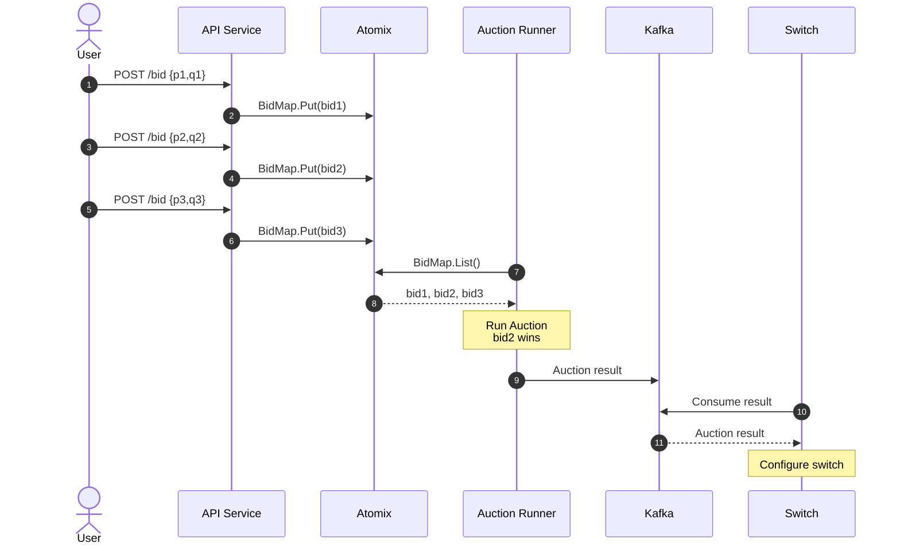
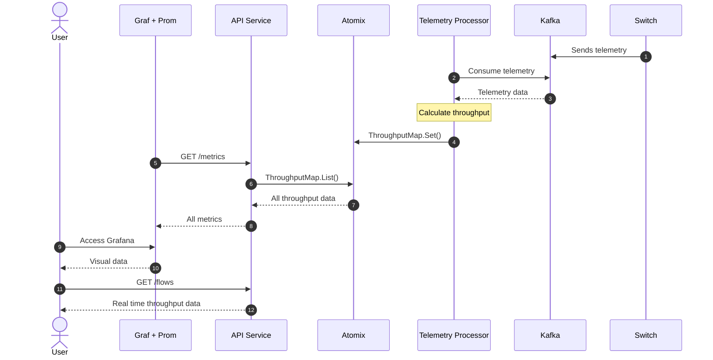

# Sequence Diagrams

### Auction System

```mermaid
sequenceDiagram
    autonumber
    actor U as User
    participant A as API Service
    participant D as Atomix
    participant R as Auction Runner
    participant K as Kafka
    participant S as Switch

    U ->> A: POST /bid {p1,q1}
    A ->> D: BidMap.Put(bid1)
    U ->> A: POST /bid {p2,q2}
    A ->> D: BidMap.Put(bid2)
    U ->> A: POST /bid {p3,q3}
    A ->> D: BidMap.Put(bid3)
    R ->> D: BidMap.List()
    D -->> R: bid1, bid2, bid3
    Note over R: Run Auction<br/>bid2 wins
    R ->> K: Auction result
    S ->> K: Consume result
    K -->> S: Auction result
    Note over S: Configure switch
```

### Telemetry System

```mermaid
sequenceDiagram
    autonumber
    actor U as User
    participant G as Graf + Prom
    participant A as API Service
    participant D as Atomix
    participant T as Telemetry Processor
    participant K as Kafka
    participant S as Switch

    S ->> K: Sends telemetry
    T ->> K: Consume telemetry
    K -->> T: Telemetry data
    Note over T: Calculate throughput
    T ->> D: ThroughputMap.Set()
    G ->> A: GET /metrics
    A ->> D: ThroughputMap.List()
    D -->> A: All throughput data
    A -->> G: All metrics
    U ->> G: Access Grafana
    G -->> U: Visual data
    U ->> A: GET /flows
    A -->> U: Real time throughput data
```