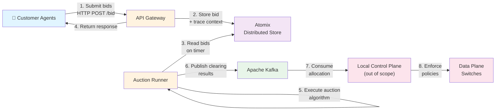
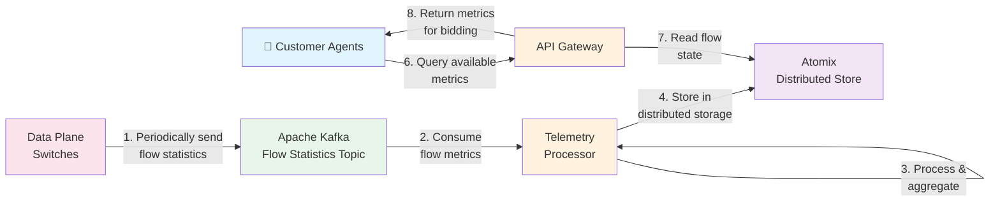
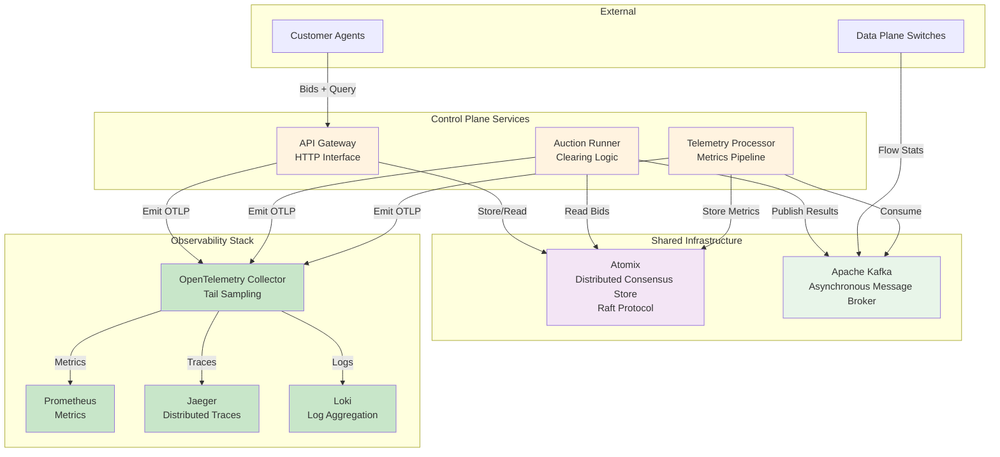
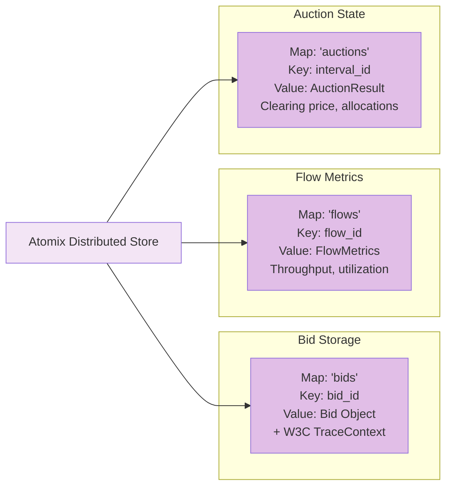
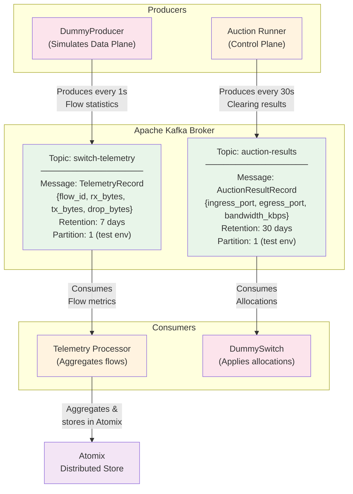

# System Architecture Diagrams

## 1. Auction System - Resource Bidding Pipeline

## 2. Telemetry System - Flow Metrics Collection Pipeline

## 3. Integrated System - Auction + Telemetry + Observability

## 4. Atomix Data Model - Shared State Structure

## 5. Kafka Message Queue Architecture

